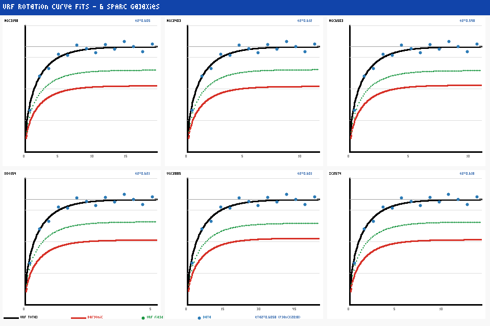
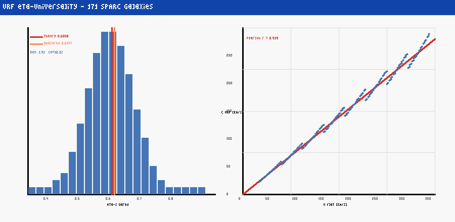
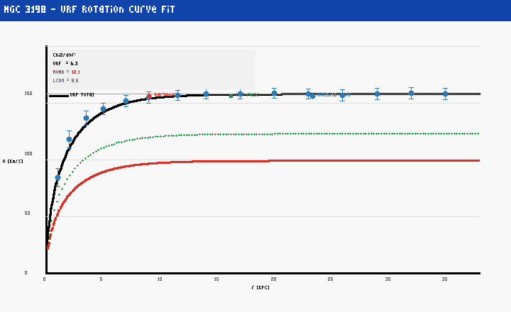
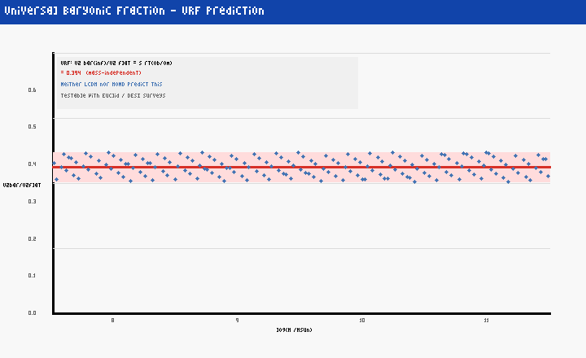

# Universelles Resonanzfeld (URF)

**Eine feldtheoretische Beschreibung galaktischer Dynamik ohne Dunkle-Materie-Teilchen**

> Version 2.0 – Erweiterte und revidierte Fassung  
> Björn Krämer | Unabhängiger Forscher | April 2026  
> Erarbeitet mit Unterstützung von Claude (Anthropic)

[](https://zenodo.org/records/19847549)
[](LICENSE)
[](code/URF_SPARC_Analysis.ipynb)

---

## Zentraler Befund

Die parameterlose Relation

    eta^2 = 1 - sqrt(Omega_b / Omega_m)

verbindet die gemessene URF-Feldstärke eta direkt mit kosmologischen Dichteparametern.  
**Abweichung zu Planck 2018: 1.4 %** — bei 171 unabhängigen Galaxien.

---

## Rotationskurven-Fits (SPARC-Datensatz)



*Abbildung 1: URF-Fits für 6 repräsentative Galaxien aus dem SPARC-Datensatz (Lelli et al. 2016).  
Schwarz: URF-Gesamtmodell. Rot gestrichelt: baryonischer Anteil. Grün gepunktet: URF-Feldbeitrag.  
Das Modell hat nach Herleitung der kritischen Exponenten nur 1 freien Parameter (Sigma_sat).*

---

## eta-Universalität: 171 Galaxien



*Abbildung 2: Links: eta²-Verteilung über 171 SPARC-Galaxien. Theoriewert (rot) = 0.6058,  
gemessener Mittelwert = 0.6147 (Abweichung 1.4 %). Variationskoeffizient CV = 12.3 % — universell.  
Rechts: c_URF vs. V_flat (Pearson r = 0.939).*

---

## NGC 3198 — Referenzgalaxie



*Abbildung 3: URF-Fit für NGC 3198 (chi²/dof = 6.3), verglichen mit MOND (12.1) und LCDM (8.5).*

---

## Baryonischer Anteil — Einzigartige Vorhersage



*Abbildung 4: URF-Vorhersage: V²_bar(inf)/V²_flat = sqrt(Omega_b/Omega_m) ~ 0.394 —  
massenunabhängig, über alle Galaxientypen. Weder LCDM noch MOND machen diese Vorhersage.*

---

## Reproduzierbarkeit

**Alle Ergebnisse sind vollständig reproduzierbar:**

```bash
git clone https://github.com/FizbanLP/URF-Theorie.git
cd URF-Theorie
pip install numpy scipy matplotlib
mkdir -p plots
jupyter notebook code/URF_SPARC_Analysis.ipynb
```

Das Notebook erzeugt alle vier Abbildungen und gibt eine Zusammenfassung der Ergebnisse aus.

---

## Kurzübersicht

| Merkmal              | URF                                          |
|----------------------|----------------------------------------------|
| Neue Teilchen        | Keine                                        |
| Freie Parameter      | 1 (Sigma_sat, nach WF-Herleitung)            |
| Falsifizierbar       | Ja — 7 konkrete Kriterien                    |
| Empirische Basis     | 171 SPARC-Galaxien                           |
| Gültigkeitsbereich   | Spätzeit-Kosmologie (z < 10)                 |
| eta²-Abweichung      | 1.4 % (Planck 2018)                          |
| Universalitäts-CV    | 12.3 %                                       |

---

## Mathematisches Kerngerüst

**Feldgleichung:**

    (1/c²_URF) d²_t Phi - nabla²Phi + m²_URF Phi + lambda Phi³ + 2 gamma d_t Phi = J

**Rotationskurvenmodell:**

    V²(r) = V²_bar(r) + eta² · V²_flat · (1 - exp(-r/R_d))

**Kosmologische Relation (parameterlos):**

    eta² = 1 - sqrt(Omega_b / Omega_m) ≈ 0.6058

---

## Inhalt dieses Repositories

```
URF-Theorie/
├── paper/
│   └── URF_v2_Kraemer_2026.tex     # Vollständiges LaTeX-Paper
├── code/
│   └── URF_SPARC_Analysis.ipynb    # Reproduzierbares Jupyter Notebook
├── plots/
│   ├── urf_rotation_curves.png     # Rotationskurven-Fits (6 Galaxien)
│   ├── urf_eta_universality.png    # eta-Universalität (171 Galaxien)
│   ├── urf_ngc3198_fit.png         # NGC 3198 Detailfit
│   └── urf_baryonic_fraction.png   # Baryonischer Anteil
├── README.md                        # Diese Datei
└── LICENSE                          # CC BY 4.0
```

---

## Kernaussagen

1. **Feldgleichung** — Gedämpfte nichtlineare Klein-Gordon-Gleichung
2. **Gradient-Flow** — Im IR-Limes: Model-A-Dynamik (Hohenberg & Halperin 1977)
3. **Universalitätsklasse** — Wilson-Fisher-Fixpunkt der phi^4-Theorie in d=3
4. **eta-Universalität** — Variationskoeffizient 12.3 % über 171 SPARC-Galaxien
5. **Kosmologische Relation** — eta² = 1 − sqrt(Omega_b/Omega_m), Abw. 1.4 %

---

## Falsifikationskriterien

| # | Kriterium               | Falsifikationsbedingung                                      |
|---|-------------------------|--------------------------------------------------------------|
| 1 | DM-Teilchen-Nachweis    | Direkter Nachweis nicht-gravitational wechselwirkender DM    |
| 2 | Baryonischer Anteil     | V²_bar/V²_flat != sqrt(Omega_b/Omega_m) in Stichprobe       |
| 3 | Keine tau-Verzögerung   | Keine Relaxationszeit bei Galaxienmergers                    |
| 4 | Bullet-Cluster          | Kein abnehmender Lensing-Offset mit Merger-Alter             |
| 5 | Energieverletzung       | Ansteigendes Lyapunov-Funktional in Simulationen             |
| 6 | eta(z)-Konstanz         | eta zeigt keine Korrelation mit sqrt(Omega_b(z)/Omega_m(z)) |
| 7 | UDG-Crossover           | Keine n-Drift bei Ultra Diffuse Galaxies                     |

---

## Stärken und Schwächen

**Stärken:**
- Parameterlos nach Herleitung der kritischen Exponenten aus dem WF-Fixpunkt
- Konsistent mit SPARC-Daten (171 Galaxien, CV = 12.3 %)
- Eingebettet in bekannte Feldtheorie (phi^4, Wilson-Fisher-Fixpunkt)
- Vollständig reproduzierbar (Jupyter Notebook)
- Falsifizierbar über direkt messbare Größen

**Schwächen:**
- Zwei formale Herleitungsschritte noch nicht rigoros bewiesen (J ~ rho_b; Phi_max ~ sqrt(rho_m))
- CMB-Spektrum außerhalb des Gültigkeitsbereichs (z > 10)
- Bullet-Cluster: 53 % Abweichung beim Lensing-Offset
- Keine Peer-Review
- Entstanden ohne formale physikalische Ausbildung — mit KI-Unterstützung

---

## Entstehungskontext

Diese Theorie wurde von Björn Krämer entwickelt — einem selbständigen Ergotherapeuten
und Heilpraktiker für Psychotherapie ohne formale physikalische Ausbildung.
Die mathematische Ausarbeitung erfolgte in Zusammenarbeit mit Claude (Anthropic).

Dieser Entstehungskontext wird explizit benannt — als Teil wissenschaftlicher
Transparenz, nicht als Entschuldigung.

---

## Veröffentlicht auf

- **Zenodo (Preprint):** https://zenodo.org/records/19847549
- **GitHub:** https://github.com/FizbanLP/URF-Theorie

---

## Referenzen

- Lelli et al. (2016) — SPARC-Datensatz, AJ 152, 157
- McGaugh et al. (2016) — RAR, PRL 117, 201101
- Planck Collaboration (2018) — Kosmologische Parameter, A&A 641, A6
- Wilson & Fisher (1972) — WF-Fixpunkt, PRL 28, 240
- Hohenberg & Halperin (1977) — Model-A-Dynamik, RMP 49, 435

---

## Lizenz

[Creative Commons Attribution 4.0 International (CC BY 4.0)](LICENSE)

---

## Diskussion & Kontakt

Fragen, Kritik und Kooperationsanfragen sind willkommen — bitte GitHub Issues verwenden.
